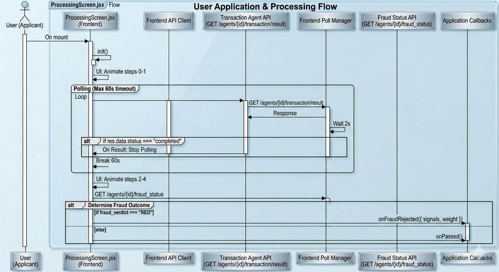

# Poonawalla Fincorp — Agentic Loan Onboarding

An end-to-end AI-powered loan onboarding system featuring a multi-agent pipeline for real-time document verification, fraud detection, and automated credit decisioning via video KYC.

## Demo Video

[Watch the Demo Video on Google Drive](https://drive.google.com/file/d/1HKknZSH7Yds1v08rpuvu4cqvm_9F-Guk/view?usp=sharing)

## Overview

This project automates the complex process of loan origination using a swarm of specialized AI agents. It guides a customer from initial application through document uploads and a live video call, concluding with an instant loan offer or rejection based on real-time risk analysis.

## 🤖 AI Agent Swarm

The system uses 10+ specialized agents working in parallel:

- **Speech Agent**: Handles real-time TTS (ElevenLabs) and STT (Groq/Whisper) during video calls.
- **DeepFace Agent**: Performs face verification (matching live video to KYC photo) and OCR on Aadhaar/PAN cards.
- **Transaction Agent**: Analyzes bank statements for income verification, tampering, and circular transactions.
- **Geo Agent**: Verifies customer's live location against their stated address.
- **Extractor Agent**: Uses LLMs to structure unstructured data from various sources into a unified loan schema.
- **Fraud Agent**: A hybrid system combining XGBoost models and LLM reasoning to detect sophisticated fraud signals.
- **Policy Agent**: Applies real Poonawalla Fincorp lending rules to determine eligibility across 13+ products.
- **Risk Agent**: Calculates a proprietary risk score based on financial and behavioral signals.
- **Offer Agent**: Generates tailored loan offers with multiple EMI options.

## � Application Processing Flow

The system follows a strict asynchronous processing flow during the "Processing" stage:


### Flow Breakdown:
1. **Initial Animation**: Immediately starts animating the first few steps to provide instant UI feedback.
2. **Transaction Polling**: The frontend polls the Transaction Agent API every 2 seconds (up to 60s) until document parsing and tampering checks are complete.
3. **Fraud Pre-Screen**: Once transactions are parsed, the system calls the Fraud Status API.
4. **Outcome Branching**: 
   - **RED**: User is redirected to a "Rejected" screen with specific fraud signals.
   - **GREEN/YELLOW**: User proceeds to the Video KYC call.

##  Tech Stack

- **Backend**: FastAPI (Python), SQLAlchemy (Async), PostgreSQL (Supabase).
- **Frontend**: React, Vite, Tailwind CSS.
- **AI/ML**: DeepFace, EasyOCR, XGBoost, Groq (LLM), ElevenLabs (TTS).
- **Database**: Supabase (Auth + Postgres).

## 📋 Prerequisites

- Python 3.9+
- Node.js 18+
- Supabase Account
- API Keys for: Groq, ElevenLabs.

## ⚙️ Setup Instructions

### 1. Clone & Environment
```bash
git clone <repo-url>
cd TensorX/PS3_SheCodes_TenzorX
```
Create a `.env` file in the root with the following:
```env
DATABASE_URL=your_supabase_postgres_url
SUPABASE_URL=your_supabase_project_url
SUPABASE_ANON_KEY=your_supabase_anon_key
GROQ_API_KEY=your_groq_key
ELEVENLABS_API_KEY=your_elevenlabs_key
```

### 2. Backend Setup
```bash
# It is recommended to use a virtual environment
python -m venv venv
source venv/bin/Scripts/activate  # Windows: venv\Scripts\activate
pip install -r requirements.txt
pip install fpdf2 email-validator # Essential extras
```

### 3. Frontend Setup
```bash
cd frontend
npm install
```

## 🏃 Running the Project

### Start Backend
```bash
cd backend
python main.py
```
*The API will be available at `http://localhost:8000`. Documentation at `/docs`.*

### Start Frontend
```bash
cd frontend
npm run dev
```
*The UI will be available at `http://localhost:5173`.*


## 🛡️ Security & Compliance
- **V-CIP Compliant**: Designed to follow RBI's Video-based Customer Identification Process.
- **Data Privacy**: Sensitive uploads are git-ignored and stored in isolated session directories.
- **Audit Trail**: Every agent action and system decision is logged in a persistent audit trail.

---
Built for the **SheCodes TenzorX Hackathon**.
